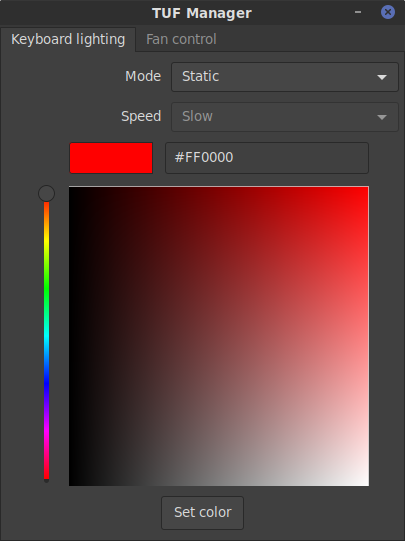
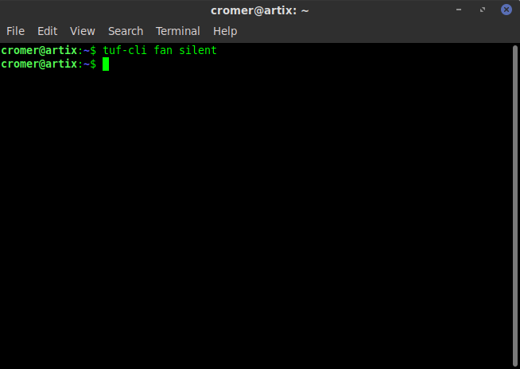

# TUF Manager

## License

[3-Clause BSD License](LICENSE)

## Screenshots

## Build requirements

To build TUF Manager the following is needed:

- vala
- valadoc
- glib
- gtk3
- gio-unix
- gobject
- dbus
- polkit
- polkit-gobject
- gmodule-export
- libnotify
- libappindicator3

## Other requirements

This software will only work if using the [hackbnw/faustus](https://github.com/hackbnw/faustus) driver module. To get notifications on fan mode changes the fork of faustus at [rublag/faustus](https://github.com/rublag/faustus) should be used instead since it supports polling.

## Build options

- valadocs

Build TUF Manager's vala documentation.

- valadocs-deps

Build external valadocs that TUF Manager utilizes and calls.

- build-cli

Build the cli interface.

- build-gui

Build the gui interface.

- build-tray

Build the tray icon

- always-authenticated

Authentication is not required to use the TUF Server that runs in the background as a daemon, if this is set to false polkit is used for authentication. Setting this to false is more secure, but also makes things like auto restore of settings on login impossible to do without a password.

## Usage

There are 3 programs and 1 daemon supplied by TUF Manager.

- tuf-cli

This allows controlling the TUF laptop functions via command line interface.

- tuf-gui

This supplies a graphical interface to control the TUF laptop.

- tuf-server

This is the daemon that runs in the background and handles all requests from both tuf-cli and tuf-gui.

- tuf-tray

This is the tray icon to control the TUF Manager program. It should automatically start in any desktop environment that supports xdg.

## Notes

The restore settings option saves the changes made on a per user basis. This means that for example if a different user logs in and the tray icon is running, it will restore their settings. So for example user A can have a blue keyboard and user B can have a green keyboard. Or even change keyboard colors based on the distro that is booted. For example when in linux mint a green keyboard and when in fedora a blue keyboard.

The other important use of the restore settings options is the fan mode. Normally fan mode does not survive a reboot. It is always set to "balanced" when booted. However now when the user logs in it restores the previous fan mode that was saved.
